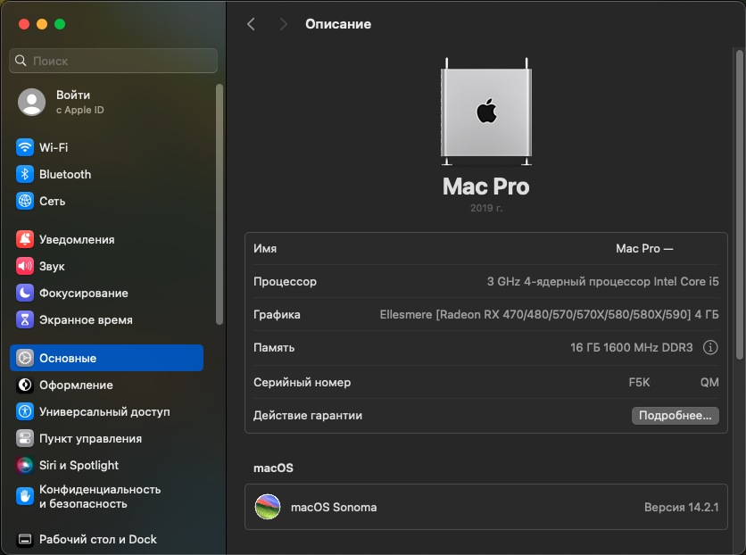
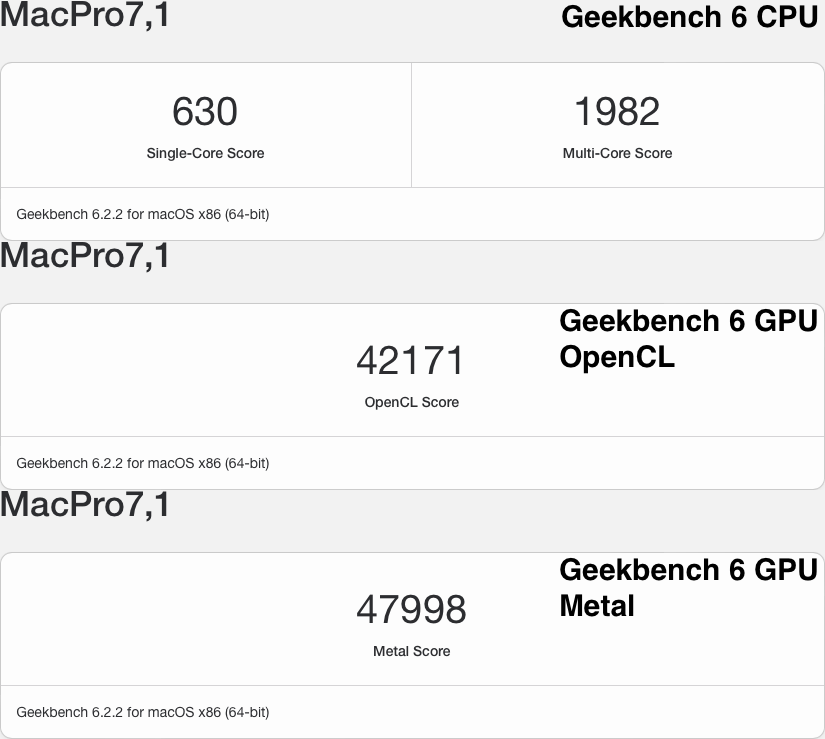
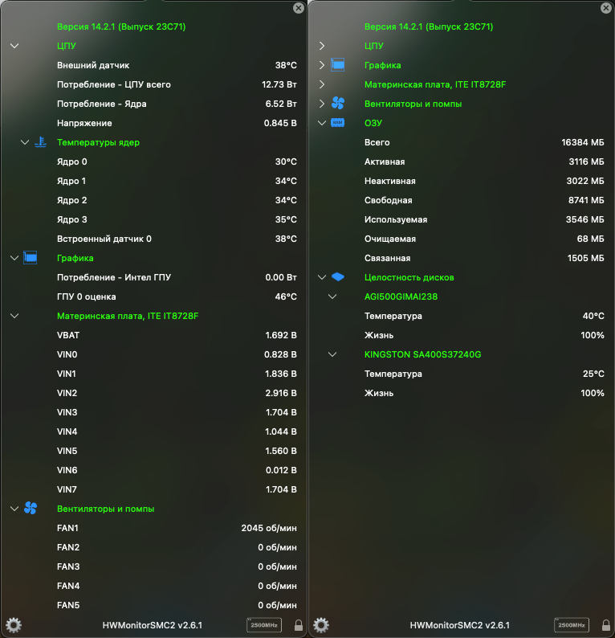

# Hackintosh ECSH61H2-M6 IvyBridge (i5-3330) Gigabyte RX580 4Gb

### ⚠️ Disclaimer | Дисклеймер

### EN:
- "EFI" as it is, it's worth using it as an **example**, don't forget
- The "EFI" may also contain extra garbage
- Read to the end of this page before you start installing anything.
- It is not a fact that "EFI" will be updated with each release of a new version of "OpenCore"
- Perhaps README is not quite complete or I could have forgotten something)))

### RU:
- "EFI" как есть, стоит использовать его как пример, не забывайте
- В "EFI" также может содержаться лишний мусор
- Прочитайте до конца эту страницу прежде чем начать что-то устанавливать.
- Не факт, что "EFI" будет обновляться с каждым выходом новой версии "OpenCore"
- Возможно README не совсем полный или я мог что-то забыть)))
##

### 📸 Screenshots | Скриншоты

<strong>Show/Показать</strong>

 

### 💻 Hardware | Железо

<strong>Show/Показать</strong>

 

| Component                      | Brand/info                                | Extra         |
|--------------------------------|:-----------------------------------------:|:-------------:|
| **Display**                    | `Xiaomi Mi Monitor 23.8" FHD (1920x1080), 75Hz, IPS-Level`          |  |
| **Chipset**                    | `Intel® H61 Express Chipset`                           |  |
| **CPU**                        | `Intel® Core™ i5-3330 3.00GHz up to 3.20GHz`           |  |
| **iGPU**                       | `Intel® HD Graphics 2500`                              | Disabled in BIOS |
| **dGPU**                       | `Gigabyte™ Radeon™ RX 580 GAMING 4G`                   | OCLP and boot-args `unfairgva=1`, when install boot-args `-amd_no_dgpu_accel` |
| **RAM**                        | `AMD Radeon R5 DDR3 2x8Gb 1600mhz`                     |  |
| **SSD #1**                     | `NTFS` `AGI AI238 512GB` (Windows is installed here).  | Visible in macOS and available in read-only mode |
| **SSD #2**                     | `APFS` `Kingston A400 256GB` (macOS is installed here) |  |
| **WIFI+Bluetooth card**        | `Not Installed`                                        | If you have WIFI+BT try use kexts like `AirportItlwm` `IntelBluetoothFirmware` `BlueToolFixup` |
| **Ethernet**                   | `Realtek 8111E 1Gbps`                                  | Used kext `RealtekRTL8111.kext` |
| **Audio**                      | `Realtek ALC662`                                       | Used key in Device Properties `layout-id = 13` |
| **Microphone+Audio jack+**     | `1x Audio port (Line Out/Line In/Mic In)`              | Same as in "Audio" |
| **Keyboard**                   | `Logitech`                                             |  |
| **Mouse**                      | `Logitech`                                             |  |
| **I/O Ports**                  | `1x PS/2 Keyboard & PS/2 mouse connectors` `1x Parallel port (LPT)` 8x USB2.0 port(s) Up to 480 Mb/s `4x Back Panel port` `4x Onboard port` | Used kexts `USBToolBox` and `UTBMap` |
| **BIOS** | `Latest - 12/27/2013` | ME FW Version 8.1.0.1248 |

### ✅️ What works | Что работает

<strong>Show/Показать</strong>

 

| English                                          | Russian                                       |
|--------------------------------------------------|-----------------------------------------------|
| Radeon RX580 with acceleration and DRM | Radeon RX580 с ускорением и DRM |
| Power management | Управление питанием |
| Sleep/Wake-up | Сон/Пробуждение |
| Audio/Microphone/Audio jack | Звук/Микрофон/Аудио джек |
| USB ports | USB порты |
| iServices* | iServices* |
| Dual Boot OS | Двойная загрузка ОС |
| Ethernet port RJ-45 | Интернет порт RJ-45 |
| Intel Turbo Boost | Intel Turbo Boost |

`*` - [GenSMBIOS](https://dortania.github.io/OpenCore-Post-Install/universal/iservices.html#using-gensmbios)  
English: You need to generate the data and insert it into the config, the guide on how to do this is indicated under the star  
Russian: Вам нужно сгенерировать данные и подставить их в конфиг, руководство как это сделать указано под звездочкой

### ❌️ What doesn't work | Что не работает

<strong>Show/Показать</strong>

 

| English                                                      | Russian                                                      |
|--------------------------------------------------------------|--------------------------------------------------------------|
| WIFI+Bluetooth (can be fixed with a Broadcom card)         | WIFI+Bluetooth (может быть исправлен с помощью карты Broadcom) |
| Airdrop (can be fixed with a Broadcom card)                  | Airdrop (может быть исправлен с помощью карты Broadcom) |

### ⚠️ Not tested | Не протестировано

<strong>Show/Показать</strong>

 

| English                 | Russian                |
|-------------------------|------------------------|
| Seems all ok and works :D | Кажется, все в порядке и работает :D |

### 🫠 Known issues | Известные проблемы

<strong>Show/Показать</strong>

 

| English                                         | Russian                                             |
|-------------------------------------------------|-----------------------------------------------------|
| After successful installation and booting, the screen will turn black. The problem is related to the graphics card and its acceleration. The solution is described in the Post-install | После успешной установки и бутинге станет черный экран. Проблема связана с видеокартой и её ускорением. Решение описано в Пост-установке |
| It does not boot from the copied EFI folder on the disk(SSD/HDD), while it boots from a USB flash drive. Boot into Windows, download Hasleo EasyUEFI. Start and add a new boot by selecting the Mac drive, EFI partition. Click browse and select EFI/BOOT/BootX64.efi file. Name the booth as you like (for example, OpenCore), save and drag it, making it the first in the list. Now you can reboot and you will be taken to OpenCore boot | Не загружается с скопированной папкой EFI на диске(SSD/HDD), при этом с флешки загружается. Загрузитесь в Windows, cкачайте Hasleo EasyUEFI. Запустите и добавьте новый бут, выбрав диск с Mac, раздел EFI. Нажмите обзор и выберите файл EFI/BOOT/BootX64.efi. Назовите бут как Вам удобно (например OpenCore), сохраните и перетащите его, сделав первым в списке. Теперь можно перезагрузиться и вы попадете в OpenCore бут |

## ⚙️ Setup | Установка

<strong>🔧 BIOS Settings | Настройки BIOS</strong>

 
English: Standard settings, with the exception of Secure Boot. To install, use EFI Install, after successful installation and configuration, replace it with EFI Post-Install
 
 
Russian: Стандартные настройки, за исключением Secure Boot. Для установки используйте EFI Install, после успешной установки и настройки замените его на EFI Post-Install
  
 

| ***Advanced*** | |
|:--|:-:|
| ACPI Settings - ACPI Sleep State | `S3 (Suspend to RAM)` |
| Sata Configuration - Sata Mode | `AHCI` |

| ***Boot*** | |
|:--|---|
| Boot - Operation System Select | `Manual` |
| Boot - Quiet Boot | `Disabled` |
| Boot - Boot Mode Select | `UEFI` |
| Boot - CSM Parameters - Launch CSM | `Disabled` |

| ***Security*** | |
|:--|---|
| Security - Secure Boot | `Disabled` |

<strong>🗒 config.plist edits</strong>

  
### Generating SMBIOS + Fix iServices:

English: You need to generate the data (Type, Serial, Board Serial, SmUUID, ROM) and insert it into the config, a complete guide on how to do this is indicated under the star 
 
 
Russian: Вам нужно сгенерировать данные (Type, Serial, Board Serial, SmUUID, ROM) и подставить их в конфиг, полное руководство как это сделать указано под звездочкой
 

| | English - Quick Guide | Russian - Краткое руководство |
|---|---|---|
| 1. | [Download GenSMBIOS](https://github.com/corpnewt/GenSMBIOS) | [Скачать GenSMBIOS](https://github.com/corpnewt/GenSMBIOS) |
| 2. | Start GenSMBIOS and select option 1 to download and install MacSerial | Запустите GenSMBIOS и выберите опцию 1, чтобы загрузить и установить MacSerial |
| 3. | Select option 3 and enter `MacPro7,1 10` 10 serial numbers will be generated | Выберите опцию 3 и введите `MacPro7,1 10` будут сгенерированы 10 шт. серийников |
| 4. | Copy and check Serial: `XXXXXX...` on [Apple page](https://checkcoverage.apple.com/) | Cкопируйте и проверьте Serial: `XXXXX...` на [странице Apple](https://checkcoverage.apple.com/) |
| 5. | If you get a red message saying "Sorry, we can't verify coverage for this serial number." then it's all right! Otherwise, go back to GenSMBIOS and select the next serial number from the previously generated ones | Если вы получите красное сообщение со словами "Извините, мы не можем проверить покрытие для этого серийного номера". тогда все в порядке! В противном случае вернитесь в GenSMBIOS и выберите следующий серийный номер из ранее сгенерированных |
| 6. | Open the config.plist and go to Platforminfo > Generic | Откройте config.plist и перейдите в Platforminfo > Generic |
| 7. | Enter the data corresponding to the desired serial number, where `Type=SystemProductName`, `Serial=SystemSerialNumber`,  `Board Serial=MLB`, `SmUUID=SystemUUID`, `ROM=ROM` | Впишите  данные соответствующие нужному серийному номеру, где `Type=SystemProductName`, `Serial=SystemSerialNumber`,  `Board Serial=MLB`, `SmUUID=SystemUUID`, `ROM=ROM` |
| 8. | Save and reboot | Сохраните и перезагрузитесь |
| **!!!** | **Important: We need an invalid serial number!** | **ВАЖНО: Нам нужен недействительный серийный номер!** |

[GenSMBIOS Complete Guide | Полная Инструкция](https://dortania.github.io/OpenCore-Post-Install/universal/iservices.html#using-gensmbios)  

## 🛠 Post-install | Пост-установка

<strong>Show/Показать</strong>

 
  
| English | Russian |
|---|---|
| Go to utilities, download and install OpenCore Configurator, the first time you will need to open with Ctrl | Перейдите в утилиты, скачайте и установите OpenCore Configurator, первый раз потребуется открытие с Ctrl |
| In the control center, click on OpenCore Configurator and mount the EFI section of the installation flash drive and the EFI section of the disk on which macOS was installed | В пункте управления нажмите на OpenСore Configurator и смонтируйте раздел EFI установочной флешки и раздел EFI диска на который устанавливался macOS |
| Copy EFI folder from the USB flash drive to the disk with the installed macOS | Скопируйте папку EFI с флешки на диск с установленной macOS |
| Unplug installation USB flash drive and restart the laptop, while restarting, hold down the F11 key to access the boot menu | Отключите установочную USB флешку и перезагрузите ноутбук, во время перезагрузки удерживайте нажатой клавишу F11, чтобы получить доступ к меню загрузки |
| In boot menu, select the disk with macOS installed | В меню загрузки выберите диск с установленной macOS |
| Go to utilities, download and install OpenCore Legacy Patcher, the first time you will need to open with Ctrl | Перейдите в утилиты, скачайте и установите OpenCore Legacy Patcher, первый раз потребуется открытие с Ctrl |
| After launching OCLP, you will see messages about "SIP", "AMFI", "SecureBoot" and the inability to apply the patch for RX580. In order to apply the patch, you need to fix config.plist in the EFI folder | После запуска OCLP вы увидите сообщения о "SIP", "AMFI", "SecureBoot" и невозможность применить патч для RX580. Для того, чтобы применить патч, нужно поправить config.plist в папке EFI|
| Open config.plist in OC Configurator. Misc - Security - SecureBootModel - `Disabled`. NVRAM - 7C436110-AB2A-4BBB-A880-FE41995C9F82 - add to boot-args - `amfi_get_out_of_my_way=0x1` and set to csr-active-config - `EF0F0000`. After the fixes, save config.plist and reboot| Откройте config.plist в OC Configurator. Misc - Security - SecureBootModel - `Disabled`. NVRAM - 7C436110-AB2A-4BBB-A880-FE41995C9F82 - добавьте в boot-args - `amfi_get_out_of_my_way=0x1` and установите в csr-active-config - `EF0F0000`. После исправлений сохраните config.plist и перезагрузитесь |
| You will also need to reset NVRAM. To do this, press the space bar in the OpenCore boot menu and select Reset NVRAM | Также Вам понадобится сбросить NVRAM. Для этого в меню загрузки OpenCore нажмите пробел и выберите Reset NVRAM |
| After resetting NVRAM, you will have the opportunity to install the patch for RX580 in OCLP. Install, wait for the prompt window to reboot and reboot | После сброса NVRAM, у Вас появится возможность установить патч для RX580 в OCLP. Установите, дождитесь окна с предложением перезагрузится и перезагрузитесь |
| Now you can enable graphics acceleration, to do this, open config.plist in OC Configurator. NVRAM - 7C436110-AB2A-4BBB-A880-FE41995C9F82 - delete from boot-args - `-amd_no_dgpu_accel`. Save and reboot | Теперь можно включить ускорение графики, для этого откройте config.plist в OC Configurator. NVRAM - 7C436110-AB2A-4BBB-A880-FE41995C9F82 - удалите из boot-args - `-amd_no_dgpu_accel`. Сохраните и перезагрузитесь |

## ⭐️ Utilities | Утилиты

<strong>Show/Показать</strong>

 

[OpenCore Configurator](https://mackie100projects.altervista.org/download-opencore-configurator/)
 
[OpenCore Legacy Patcher](https://github.com/dortania/Opencore-Legacy-Patcher/releases)
 
[Hackintool](https://github.com/benbaker76/Hackintool/releases)
 
[HWMonitorSMC2](https://github.com/CloverHackyColor/HWMonitorSMC2/releases)
 
[PlistEdit Pro](https://www.fatcatsoftware.com/plisteditpro/)
 
[IORegistryExplorer](https://github.com/utopia-team/IORegistryExplorer/releases)
 
[MaciASL](https://github.com/acidanthera/MaciASL/releases)
 
[Intel Power Gadget](https://www.intel.com/content/dam/develop/external/us/en/documents/downloads/intel-power-gadget.dmg)
  

